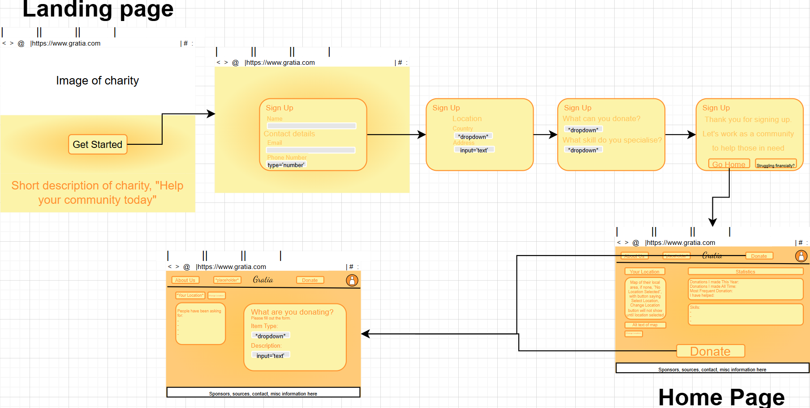
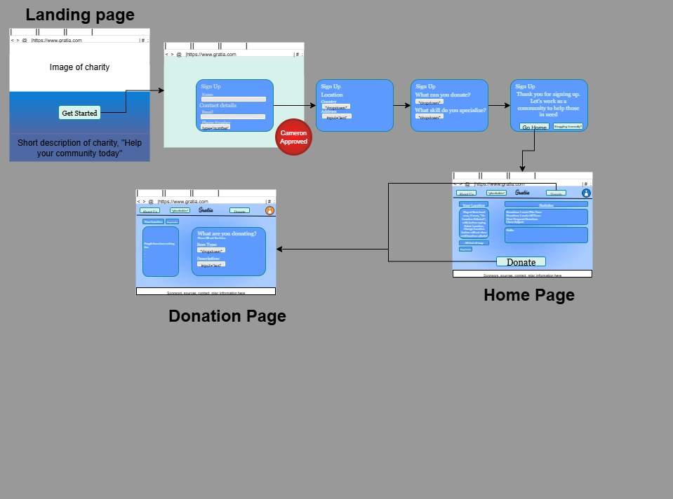

# Gratia

## Week 1, 25/07/25

This website is for the public to officially sign up to a community run charity website that helps those people in need. It receives data input from sign up members, including location, to figure out the best way to help the community. It encourages people to either donate items that are bought, as well as building items using wood etc. When someone signs up, they will provide basic details like name, email, number, and location. This data will be transferred to an sql database and sorted in different sections, based on location. Once on the home page, they will be led to a tutorial that automatically plays for the first time that introduces them to the website to understand it. A settings/profile page is essential for the person to change data. The big thing that someone can do is report/say that they have something for donation, where they will be informed about what to donate, why donate, and how to donate, including an interactive element to decide what to donate. After they confirm they have something to donate through a form, they will be told about where to drop off the item and other details, as well as a link for people donating big products like mattresses or beds, that asks for help from the nearby community to load or lug the stuff to the location if they cannot do it. This page will also have information about how to do it yourself. From the sign up page, a member is allowed to apply to receive donations when in a time of need. They will be required to fill out information confirming their identity and financial situation. The data received from this will go into a database that logs what they need, and throughout the year, they will be placed onto a waiting list that attempts to find items donated by the public.

| Functional Requirements | Non-functional Requirements |
| ----------------------- | --------------------------- |
| Sign-up/Sign-in | Look friendly and interesting to users |
| Store, sort, and filter data in database | Easy to use and navigate app/website |
| Notify users and respond to user input | Informative, useful information |
| Tutorial to app/website | Interactive elements; buttons, sliders, etc. |

## Week 2, 31/07/25

The image includes several pages, including a Landing Page(top left), Home Page(bottom right), and Donate Page(bottom left).

The colour palette I have chosen for my website uses shades of orange and yellow, warm colours usually associated with warmth, happiness, vitality, and friendly moods. 

The use of rounded rectangles compared to sharp corners is to make the website feel more rounded and friendly. 

The landing page has a button which leads to a sign up page which collects data from the person. This data is collected into a database which is used for future applications.

In the home page, there is a 'Donate' button which leads to a donate page, which includes another form which asks about what the person will be donating. 

## Week 3, 08/08/25

I changed the colour scheme from shades of orange to shades of blue. I chose a really light blue, a medium-light blue, and a darker blue. Most of my text will be in the really light blue, contrasted by the medium-light blue as its background. The darker blue will be used as an outline, to contrast with the really-light blue background.

The buttons however, will have the text in black, the background in really-light blue, and the border as normal. Using this colour scheme, the user can easily distinguish buttons from normal text boxes. Using a similar border colour will make the website's buttons feel more connected with the buttons and the text boxes.

All of the font was also adapted to "Georgia". This font was chosen to make the website feel more professional. The arrangement of the pages is the same as last week's, because other iterations I tried, the website's information did not flow.