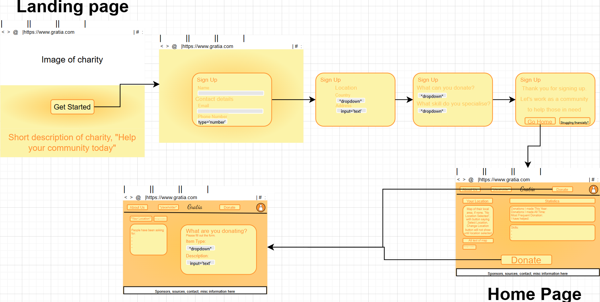
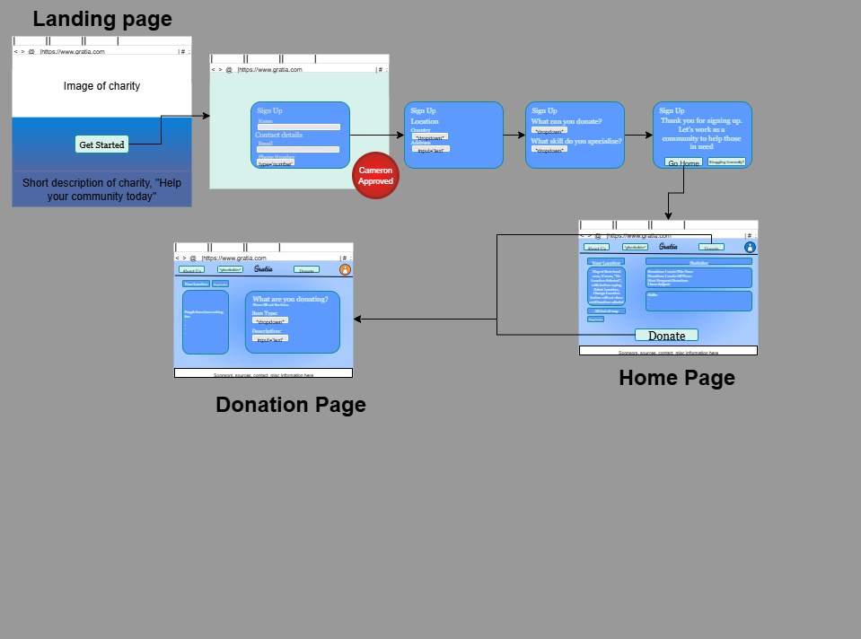
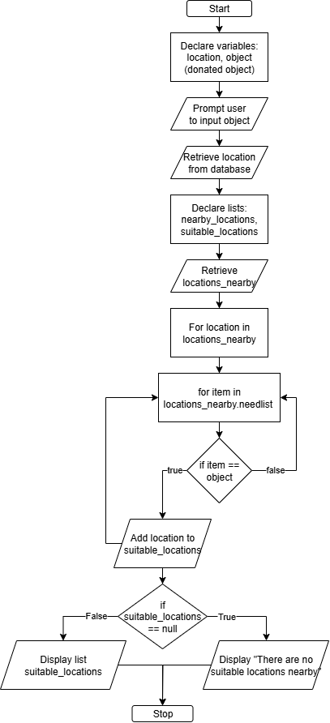

# Gratia

## Week 1, 21/07/25 - 25/07/25

### Description

This website is for the public to officially sign up to a community run charity website that helps those people in need. It receives data input from sign up members, including location, to figure out the best way to help the community. It encourages people to either donate items that are bought, as well as building items using wood etc. When someone signs up, they will provide basic details like name, email, number, and location. This data will be transferred to an sql database and sorted in different sections, based on location. Once on the home page, they will be led to a tutorial that automatically plays for the first time that introduces them to the website to understand it. A settings/profile page is essential for the person to change data. The big thing that someone can do is report/say that they have something for donation, where they will be informed about what to donate, why donate, and how to donate, including an interactive element to decide what to donate. After they confirm they have something to donate through a form, they will be told about where to drop off the item and other details, as well as a link for people donating big products like mattresses or beds, that asks for help from the nearby community to load or lug the stuff to the location if they cannot do it. This page will also have information about how to do it yourself. From the sign up page, a member is allowed to apply to receive donations when in a time of need. They will be required to fill out information confirming their identity and financial situation. The data received from this will go into a database that logs what they need, and throughout the year, they will be placed onto a waiting list that attempts to find items donated by the public.

### Website Requirements
| Functional Requirements | Non-functional Requirements |
| ----------------------- | --------------------------- |
| Sign-up/Sign-in | Look friendly and interesting to users |
| Store, sort, and filter data in database | Easy to use and navigate app/website |
| Notify users and respond to user input | Informative, useful information |
| Tutorial to app/website | Interactive elements; buttons, sliders, etc. |

## Week 2, 28/07/25 - 01/07/25

### Wireframe



The image includes several pages, including a Landing Page(top left), Home Page(bottom right), and Donate Page(bottom left).

The colour palette I have chosen for my website uses shades of orange and yellow, warm colours usually associated with warmth, happiness, vitality, and friendly moods. 

The use of rounded rectangles compared to sharp corners is to make the website feel more rounded and friendly. 

The landing page has a button which leads to a sign up page which collects data from the person. This data is collected into a database which is used for future applications.

In the home page, there is a 'Donate' button which leads to a donate page, which includes another form which asks about what the person will be donating. 

## Week 3, 04/08/25 - 08/08/25

### Experimentation - Alternate Wireframe



I changed the colour scheme from shades of orange to shades of blue. I chose a really light blue, a medium-light blue, and a darker blue. Most of my text will be in the really light blue, contrasted by the medium-light blue as its background. The darker blue will be used as an outline, to contrast with the really-light blue background.

The buttons however, will have the text in black, the background in really-light blue, and the border as normal. Using this colour scheme, the user can easily distinguish buttons from normal text boxes. Using a similar border colour will make the website's buttons feel more connected with the buttons and the text boxes.

All of the font was also adapted to "Georgia". This font was chosen to make the website feel more professional. The arrangement of the pages is the same as last week's, because other iterations I tried, the website's information did not flow.

| Changes | Reasoning |
| ------- | --------- |
| Colour Palette | The shade of blue is very light makes the website feel relaxing and it looks good |
| Text | Changed font to "Georgia", it is a pleasant and professional font. The colour is in a lighter blue, which looks good and contrast with the box background colour. |
| Buttons | Their font is also changed to "Georgia". The font colour of the buttons are set to black, to accentuate the importance of this thing. |
| Style | Contrast between buttons and text helps the reader differentiate between the both easier. Rearranging colour schemes makes them look different, so the mind recognises it is not text but a button, and vice versa. |

## Week 4, 11/08/25 - 15/08/25

### Main Website Process

#### Flowchart



The donation process will start with the code declaring two variables: the user's location, and the donated object. The user's location will be taken from a user database, which is collected during the sign up process. After this, the user will be prompted about the object they plan to donate. From here, the system will create two lists: nearby_locations, and suitable_locations. nearby_locations will be taken from a list of locations closest to the user's current location, while suitable_locations will be empty for now.

Then, the system will iterate through nearby_locations, and iterate through a child list *needlist*. When iterating through *needlist*, the item iterated will be compared to the object the user will be donating, and if there is a match, the location will be added to suitable_locations. However, if there is no match, then it will keep iterating. At the end, the system will check whether the list suitable_locations is empty or not. If the list is empty, then the system will display or output a message, saying that there are no suitable locations nearby. If the list is not empty, then the user will see a list of all of the suitable locations, including the distance from their current location to that location.

#### In Pseudocode

This can be written in pseudocode:
1. Declare variables: <br>
     1.1. var `location = string`; <br>
     1.2. var `object = string`; <br>
2. Identify variables: <br>
     2.1. `location = user.location`; <br>
     2.2. `object = input(string)`; <br>
3. Declare lists: <br>
     3.1. `const nearby_locations = [string];` <br>
     3.2. `var suitable_locations = [string];` <br>
4. Identify list: <br>
     4.1. `nearby_locations = getNearbyLocations(location)`; <br>
5. Iterate through list to find match: <br>
     5.1. for `location in nearby_locations` <br>
         5.1.1. for `item in location.needlist` <br>
             5.1.1.1. `if item == object` <br>
                  5.1.1.1.1. `suitable_locations.add(location);` <br>
6. Check whether a suitable location is found, and output accordingly: <br>
     6.1. `if suitable_locations == null` <br>
         6.1.1. `print("There are no suitable locations nearby")` <br>
     6.2. `else` <br>
         6.2.1. `print(suitable_locations)` <br>

The core of the website is the sign up page, which must be built before the donation process.

### Website Test Cases

#### Test Case: TC001  <br>
Test Name: Verify Sign Up Process  <br>
Preconditions: No preexisting account, location access  <br>
Test Steps:
1. Open the website and navigate to the sign up page
2. Fill out details, including name, a way of contact, location, and extra details
3. Click the "Sign Up" button

Expected Result: The webpage will transition to the home page, with a working profile.  <br>
Priority: High

The following test case reflects how the process will function.


#### Test Case: TC002  <br>
Test Name: Verify Donation Process  <br>
Preconditions: A preexisting account, location access  <br>
Test Steps:
1. Open the website and navigate to the donation page
2. Input the object to be donated
3. Wait

Expected Result: The webpage will display either a list of locations nearby, or a string saying there is no locations nearby.  <br>
Priority: Medium-High

## Week 5, 18/08/25 - 24/08/25

### Visual Studio Extensions

Due to unexpected technical difficulties, installation of Visual Studio extensions has been delayed until the following week.

### Databasing

There exists two main databases that exist within the website: Users Database, and Donation Database.

##### [Example User Database](https://schoolsnsw-my.sharepoint.com/:x:/g/personal/kai_chen3_education_nsw_gov_au/EQJ_SgqyaH5PnRy28wqDa70BHPOA8OdEnBo3d1rIPg7j2w?e=fnWh5r&nav=MTVfezAwQ0EyMzg2LTI0RTUtNDdFQS05OTY5LTk5OTMzMkU2NzYzM30)
##### [Example Donation Database](https://schoolsnsw-my.sharepoint.com/:x:/g/personal/kai_chen3_education_nsw_gov_au/EQJ_SgqyaH5PnRy28wqDa70BHPOA8OdEnBo3d1rIPg7j2w?e=eqewYI&nav=MTVfezY1RkU3MDlFLTRCMDYtNDcxMi04QjlCLTExQTI1RUYyNDYxMX0)

#### Users Database
| Column | Description |
| ------ | ----------- |
| ID | A unique user ID that links the user's info. |
| First Name | The first name or username of the user. |
| Last Name (optional) | The last name or username of the user (optional). |
| Password Hash | An encrypted unique password hash used to confirm sign-in. |
| Email | The user's email. Either the email or phone number must be filled. Used to contact the user. |
| Phone Number | The user's phone number. Either the email or phone number must be filled. Used to contact the user. |
| City | The city location the user has set. Donatios will be focused on this location. |
| Suburb | The suburb location the user has set. Donation locations will be adjusted with this location. |
| Potential Donations | A category of items the user has set. The user's donation feed will be adjusted according to this. |
| Skills | A skillset the user has set. The user's donation feed will be adjusted according to this. |
| Struggling? | Boolean, describes the user's condition. Describes whether they will be receiving donations. |

#### Donation Database
| Column | Description |
| ------ | ----------- |
| Donation ID | A unique donation ID that links the donation's info. |
| Donator ID | The user ID of the donor. |
| Recipient ID | The user ID of the recipient |
| Item | The item donated |
| Location | The agreed location of the donation. |
| Successful? | Boolean, describes if the donation was successful. |

### Example SQL Queries

The results to the following SQL Queries are [here](https://schoolsnsw-my.sharepoint.com/:x:/g/personal/kai_chen3_education_nsw_gov_au/EQJ_SgqyaH5PnRy28wqDa70BHPOA8OdEnBo3d1rIPg7j2w?e=yJeMJ1&nav=MTVfe0ZERDFGMTMyLTMwNzAtNDE5OS04QUY0LUVBNTg3MjdCMDJBOH0)

1. Filtering struggling users
```
SELECT
     ID,
     [First Name] + ' ' + [Last Name] AS Name
FROM
     Users
WHERE
     Struggling = 'TRUE'
ORDER BY
     ID ASC;
```

2. Finding nearby locations
```
SELECT
     DISTINCT City + ', ' + Suburb AS [Nearby Locations]
FROM
     Users
WHERE
     City = 'New York';
```

3. Filtering who can donate food
```
SELECT
     ID,
     [First Name] + ' ' + [Last Name] AS Name,
     [Potential Donations]
FROM
     Users
WHERE
     [Potential Donations] = 'Food%'
ORDER BY
     [Potential Donations];
```

4. Filtering unique donors
```
SELECT
     ID,
     [First Name] + ' ' + [Last Name] AS Name,
     COUNT([Donation ID]) AS Donations
FROM
     Users
INNER JOIN
     Donation ON Users.ID = Donation.[Donor ID]
GROUP BY
     ID,
     [First Name],
     [Last Name];
```

5. Inventory of Recipients from donations
```
SELECT
     ID,
     [First Name] + ' ' + [Last Name] AS Name,
     GROUP_CONCAT(Item) AS [Received Items]
FROM
     Users
INNER JOIN
     Donation ON Users.ID = Donation.[Donor ID]
GROUP BY
     ID,
     [First Name],
     [Last Name];
```

## Week 7, 01/09/25 - 05/09/25

### Visual Studio Extensions

Installation of SQLite and SQL Server Compact Toolbox now allows databasing in Visual Studios. <br>
Gitbash has been installed with the use of an extension. It was downloaded with Visual Studio's python support. <br>
Line endings is part of Visual Studio in the settings.

### Databasing

Both Donation and Users databases have been implemented into the repository.
